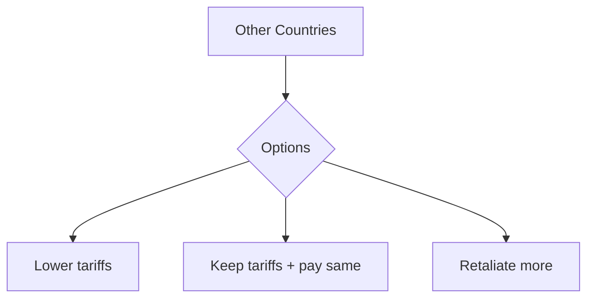

# Trump's Reciprocal Tariffs: Global Effects Analysis 

## 1. What the Policy Says  
President Trump wants to create "fair" trade by matching other countries' tariffs. If Country X charges 5% on U.S. goods, America will charge 5% on Country X's products. Key points:  
- Applies to 143 trading partners  
- Includes VAT taxes (common in Europe) as "hidden tariffs"  
- Bans sneaking goods through third countries  
- Counts non-money barriers like strict product rules  

## 2. Immediate Global Reactions  
### Trade Partners' Choices:  

*Most analysts think 60% will choose option D based on 2018 trade war patterns*

### Problem Areas:  
- **EU:** 21% average VAT could mean $380 billion in new U.S. tariffs  
- **China:** May block more U.S. tech companies in response  
- **Mexico:** Could lose 15% auto parts trade due to new rules  

## 3. Long-Term World Impacts  
### Economic Changes:  
- **Factory Moves:** Companies like Samsung (South Korea) already planning U.S. factories to avoid tariffs  
- **Price Rises:** Consumers pay 8-12% more for electronics/clothes (estimate)  
- **New Trade Groups:** Countries may make deals without America, like RCEP in Asia  

### Political Effects:  
- WTO court cases could increase by 40%  
- Developing countries like Vietnam might lose 500,000 jobs  
- Possible "trade cold war" between U.S. and VAT countries  

## 4. Difficult Questions  
- **Fairness:** Is matching tariffs truly fair if countries have different economic sizes?  
- **Enforcement:** Who decides what counts as "non-money barrier"?  
- **Environment:** Will companies ignore eco-rules to cut costs for U.S. production?  

## 5. Possible Solutions  
1. Create international tariff calculator accepted by all  
2. Special rules for poor countries  
3. Digital trade agreements for online services  