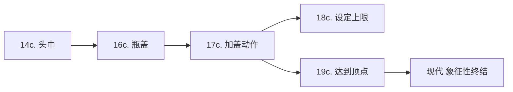
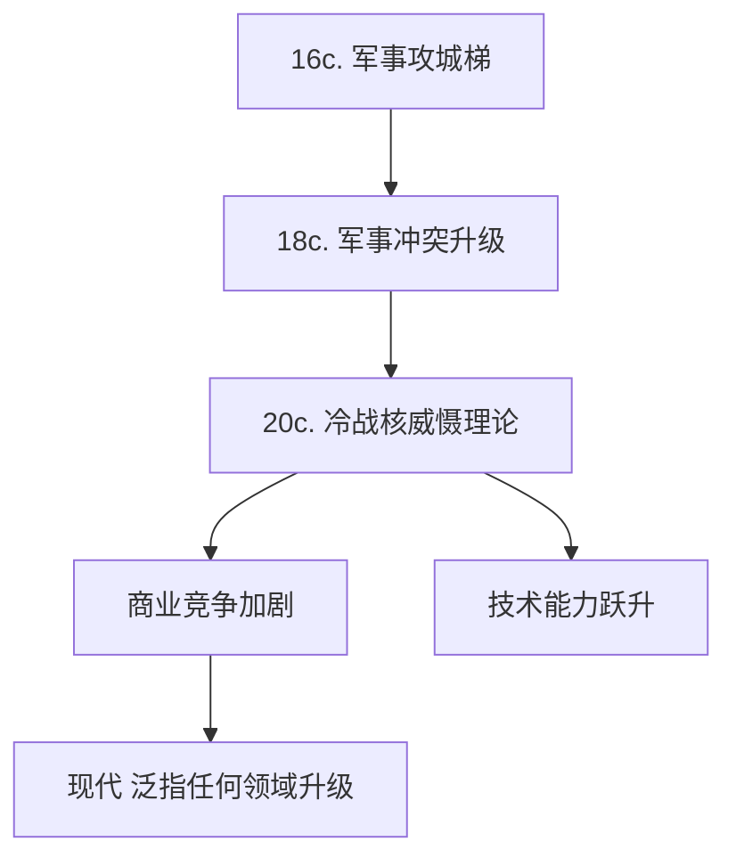

---
{"title":"词汇深度解析","tags":["research"],"date":"2025-02-22","dg-publish":true,"permalink":"/jask/input//","dgPassFrontmatter":true}
---

# Cap
[[Jask/input/读书笔记/Unit1\|Unit1]] 原文语境：  
"The high-profile event... **caps** a year of intense escalation in global discussions about AI safety"

## 语义层次
1. **物理本义**  
   源自拉丁语 _cappa_（头巾），最初指容器顶部的覆盖物（如瓶盖）。动词化后表示"加盖"动作。

2. **隐喻延伸**  
   - **顶点象征**：像给瓶子加盖标志制作完成，引申为"达到顶峰"
   - **终结功能**：如同盖上盖子结束存储过程，引申为"结束某个阶段"
   - **控制含义**：类似瓶盖限制内容物溢出，衍生出"设定上限"的金融用语（如 interest rate cap）

## 特殊语境对比
| 用法类型 | 示例                                            | 中文对应        |
| ---- | --------------------------------------------- | ----------- |
| 自然终结 | The discovery **capped** his 20-year research | 为20年研究画上句号  |
| 人为设定 | The government **capped** energy prices       | 设定能源价格上限    |
| 体育隐喻 | Her goal **capped** a brilliant comeback      | 为精彩逆转定格高光时刻 |

## 新闻高频搭配
1. **cap a series of...**（为系列事件收尾）  
   "The treaty caps a series of diplomatic efforts"
2. **years capped by...**（以...为标志的岁月）  
   "A decade capped by technological breakthroughs"
3. **capstone achievement**（巅峰成就）  
   "The Nobel Prize was the capstone of her career"

## 常见误用警示
⚠️ 避免混淆：
- **Capital**（首都/资本）无关  
- **Caption**（字幕/说明）词源不同  
- **Cape**（披风/海角）同源但语义分化

## 词义演变地图

---
# Escalation  
[[Jask/input/读书笔记/Unit1\|Unit1]] 原文语境：  
"...intense **escalation** in global discussions about AI safety"

## 语义层次
1. **物理本义**  
   词根 _escalade_（梯子），原指中世纪攻城战术中使用云梯攀越城墙的军事行为，现保留在军事术语"escalade tactics"中。

2. **隐喻延伸**  
   - **冲突升级**：古巴导弹危机中的"escalation dominance"（升级控制权）概念  
   - **程度递增**：经济领域的"wage-price escalation spiral"（工资-物价螺旋上升）  
   - **技术扩散**：网络安全中的"privilege escalation attack"（权限提升攻击）

## 特殊语境对比
| 使用维度 | 典型场景                      | 中文对应         |
| ---- | ------------------------- | ------------ |
| 军事安全 | nuclear escalation        | 核升级          |
| 商业谈判 | tariff escalation         | 关税逐步加征       |
| 社会运动 | escalation of protests    | 抗议活动激化       |
| 技术领域 | AI capability escalation  | 人工智能能力快速迭代升级 |

## 新闻高频搭配
1. **uncontrolled escalation**（失控升级）  
   "The AI arms race risks uncontrolled escalation"
2. **de-escalation mechanism**（降级机制）  
   "Diplomats are seeking de-escalation mechanisms"
3. **escalation trajectory**（升级轨迹）  
   "The conflict follows a predictable escalation trajectory"

## 常见误用警示
⚠️ 注意区分：
- **Elevation**（海拔/晋升）：仅指物理高度或职级提升  
- **Acceleration**（加速）：强调速度而非程度变化  
- **Amplification**（放大）：侧重影响范围扩展而非层级递进

## 词义演变地图

## 深度解析
在[[Jask/input/读书笔记/Unit1\|Unit1]]语境中，"escalation"生动描绘了ChatGPT问世后AI安全讨论的**三级跳式发展**：  
1. **速度维度**：从学术圈到政界的讨论层级跃升  
2. **强度维度**：由理论探讨转向政策制定的质变  
3. **范围维度**：从技术社区扩散至全民关注的量变

这种升级模式符合"escalation ladder"理论模型，其显著特征包括：  
- 触发事件（ChatGPT发布）  
- 正反馈循环（媒体关注→政策响应→更多讨论）  
- 多主体参与（政府/企业/公民社会）  

正如英国科技大臣所言，这种escalation既是风险也是机遇，关键在于如何建立有效的_"de-escalation valve"_（降压阀）机制，在促进AI发展与管控风险间取得平衡。